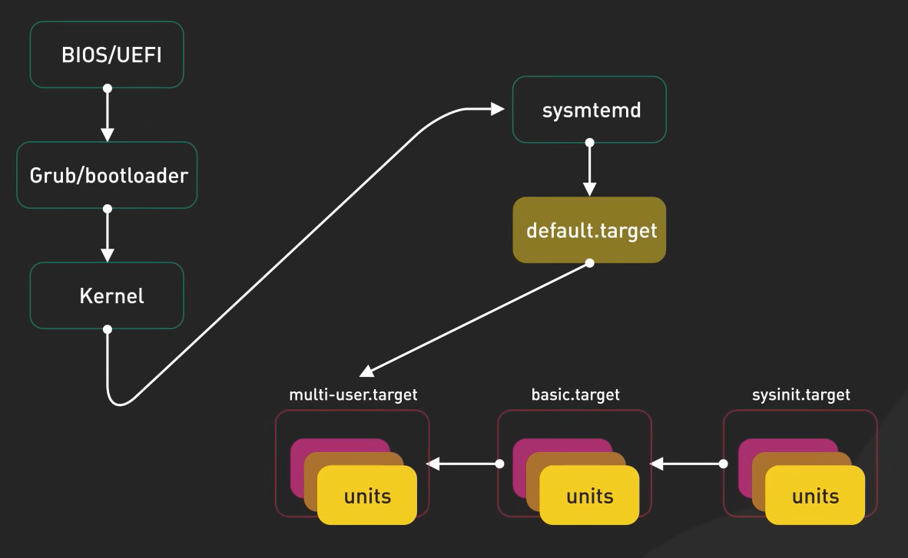

# Auto Launch Program on Boot

This guide will show you how to launch a program on boot in a Linux system using systemd, routine execution is also covered.

## Problem

You want to automatically launch a program whenever your linux machine boots up.

## Background

In linux system boot sequence, BIOS/UEFI gets loaded and executed, later it triggers the boot loader (ex: GRUB) which loaded the OS. Once the OS is loaded, it execute a service called "systemd" [1]. This service later starts all of the background processes necessary for modern day OS. In our case, we can use the ability to launch processes/services powered by systemd to achive our goal.



Figure 1: Linux Boot Process [2]

## Solution 1: systemd

### Step 1: Create a Service File

In this step, let's create a service file that systemd can use to launch our program. After activated, the program launched by this service is considered as a daemon process.

1. Create a service file in path `/lib/systemd/system/<service_name>.service`, which can very depending on the Linux distribution you are using. This is proven to work on both Ubuntu and Raspbian.
    ```bash
    sudo touch /lib/systemd/system/test_service.service
    ```
2. Open the file in a text editor and add the following content:
    ```ini
    [Unit]
    Description=This is a test service for demonstration
    After=multi-user.target     # When the service should be started
    StartLimitIntervalSec=0     # Interval to wait before restarting a service when it fails (return code is non-zero)
    
    [Service]
    User=<your_account_name>    # Which account to run the service under, if not specified, it will run under root
    Type=simple                 # Type of service, simple is the most common option for one-off tasks
    KillMode=mixed              # How to kill the service, mixed is used to kill all associated processes (including child processes)
    #TimeoutSec=60              # How long to wait before considering the service as failed and killing it, now disabled, set to 60 seconds
    #ExecStartPre=/bin/sleep 5  # Command to run before the main command, now disabled, set to sleep for 5 seconds
    ExecStart=/usr/bin/python3 /home/test.py    # Command to run, in this case, it is a python script
    
    [Install]
    WantedBy=multi-user.target  # Which case the service should be started, in this case, all account will trigger the service
    ```

If you want to know more about the options in the service file, you can search for them in various Linux documentation websites.

### Step 2: Activate the Service

1. Make systemd reload the service files.
    ```bash
    sudo systemctl daemon-reload
    ```
2. Enable the service to start on boot. Change following command to your service name.
    ```bash
    sudo systemctl enable test_service.service
    ```
3. Start the service now.
    ```bash
    sudo systemctl start test_service.service
    ```
4. Check the status of the service.
    ```bash
    sudo systemctl status test_service.service
    ```
5. (optional) Check the log of the service.
    ```bash
    sudo journalctl -u test_service.service
    ```
6. (optional) Stop the service.
    ```bash
    sudo systemctl stop test_service.service
    ```
7. (optional) Disable the service from starting on boot.
    ```bash
    sudo systemctl disable test_service.service
    ```

### Step 3: (optional) Routine Execution

In this step, let's create a timer service that will routinely trigger our service, which in turn will launch our program.

1. Create a service file in path `/lib/systemd/system/<service_name>.timer`, which can very depending on the Linux distribution you are using. This is proven to work on both Ubuntu and Raspbian.
    ```bash
    sudo touch /lib/systemd/system/test_service.timer
    ```
2. Open the file in a text editor and add the following content:
    ```ini
    [Unit]
    Description=This is a test service for demonstration
    
    [Service]
    OnCalendar=hourly           # How often to trigger the service, in this case, hourly
    #OnBootSec=1m               # How long to wait before triggering the service after boot, now disabled, set to 1 minute
    #OnUnitActiveSec=1m         # How long to wait before re-triggering the service after previous launch, now disabled, set to 1 minute
    Unit=test_service.service   # Which service to trigger
    RemainAfterElapse=no        # Whether to keep this timer service active after it triggers the target service
    
    [Install]
    WantedBy=timers.target      # Which case the service should be started, in this case, by timers.target
    ```
3. Follow the same steps as in Step 2 to activate the timer service.

### Step 4: (optional) Write a Script to Automatically Finish All the Steps

You can modify the following script to your needs while following the [Provided License](https://github.com/belongtothenight/bash_scripts/blob/main/LICENSE).

1. [schedule_routine.sh](https://github.com/belongtothenight/bash_scripts/blob/main/src/schedule_routine.sh): This is another script that will setup a `update_task.timer` to routinely trigger the `update_task.sh` to execute a custom script `update_task.sh` after system boot.

## Solution 2: Desktop Entry

This solution is preferred for GUI applications, as it will launch the application in the user's desktop environment. Also, it is a lot easier to setup compared to systemd.

### Step 1: Create a Desktop Entry File

1. Create a desktop entry file in path `$HOME/.config/autosart/<app_name>.desktop`:
    ```bash
    touch $HOME/.config/autostart/test.desktop
    ```
2. Open the file in a text editor and add the following content:
    ```ini
    [Desktop Entry]
    Type=Application
    Version=1.0
    Name=Test
    Comment=This is a test entry to launch a script on boot
    Exec=/bin/bash /opt/boot_trigger.sh
    StartupNotify=false
    Terminal=true               # This is set to true to launch the script in a terminal window
    ```
3. Create the script that you want to launch in path `/opt/boot_trigger.sh`:
    ```bash
    touch /opt/boot_trigger.sh
    echo -e "\
    #!/bin/bash\n\
    gnome-terminal\n\
    sleep infinity # This is to keep the original terminal open for debugging\n\
    " > /opt/boot_trigger.sh
    ```
    
Next time you boot up your system, you will see a terminal window pop up automatically.
    
### Step 2: (optional) Write a Script to Automatically Finish the Step

You can modify the following script to your needs while following the [Provided License](https://github.com/belongtothenight/bash_scripts/blob/main/LICENSE).

1. [schedule_startup.sh](https://github.com/belongtothenight/bash_scripts/blob/main/src/schedule_startup.sh): This is a script that will setup a `update_task.service` to execute a custom script `update_task.sh` after system boot.

## References

1. [https://systemd.io/](https://systemd.io/)
2. [YouTube - ByteByteGo - How Does Linux Boot Process Work?](https://youtu.be/XpFsMB6FoOs?si=69epCUbu9p4JavW7)
3. [https://unix.stackexchange.com/questions/48203/run-script-once-a-day-with-systemd](https://unix.stackexchange.com/questions/48203/run-script-once-a-day-with-systemd)
4. [https://www.freedesktop.org/software/systemd/man/latest/systemd.timer.html](https://www.freedesktop.org/software/systemd/man/latest/systemd.timer.html)
5. [https://www.reddit.com/r/Fedora/comments/o1s94a/systemdissue_launch_gnome_terminal_startup/](https://www.reddit.com/r/Fedora/comments/o1s94a/systemdissue_launch_gnome_terminal_startup/)
6. [https://unix.stackexchange.com/questions/319341/how-do-i-debug-a-desktop-file](https://unix.stackexchange.com/questions/319341/how-do-i-debug-a-desktop-file)

## Error Correction

If you find any mistakes in the document, please create an [Issue](https://github.com/belongtothenight/belongtothenight.github.io/issues) or a [Pull request](https://github.com/belongtothenight/belongtothenight.github.io/pulls) or leave a message in [Discussions](https://github.com/belongtothenight/belongtothenight.github.io/discussions) or send me a mail directly with the mail icon at the bottom right. Thank you!
