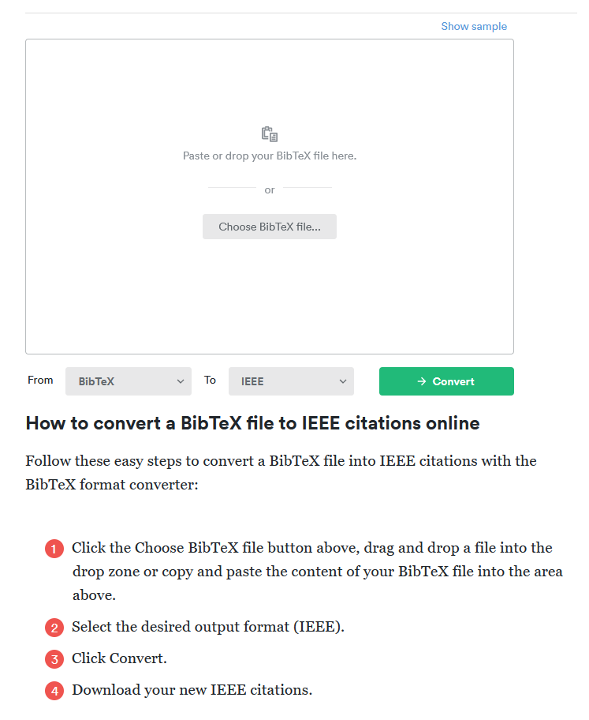

# Create Standard Reference with BibTeX

This guide will show you how to create a standard reference word style with BibTeX and showcase with Institute of Electrical and Electronics Engineers (IEEE) format.

## Problem

When writing a paper, you want to have the correct format of reference in the paper.

## Background

BibTeX is a file format aims to help with managing references in LaTeX documents, and is frequently used in academic writing. It is sort of like JSON format, acting as the standard format to be easily converted into other reference formats.

BibTeX file has the following structure: (filename with ".bib" extension)

```bibtex
@entry_type{citation_key,
    field1 = {value1},
    field2 = {value2},
    fieldn = {valuen}
    }
```

Indentation is not necessary, but it is recommended for readability.

## Solution

Finished step 1, and then continue to step 2-1 or step 2-2.

### Step 1: Create a BibTeX file

1. Create a new file with ".bib" extension, e.g. "reference.bib":
    ```bash title="Linux Bash"
    touch reference.bib
    ```
    ```pwsh title="Windows PowerShell"
    New-Item reference.bib
    ```
2. Copy BibTeX from website:
    1. IEEE Xplore:
        1. Find the paper you want to cite.
        2. Click "Cite This" and select "BibTeX".
        3. Click "Copy" and paste it into the ".bib" file.
    2. Research Gate:
        1. Find the paper you want to cite.
        2. Click "Download citation".
        3. Select "BibTeX" from "What type of file do you want?".
        4. Click "Copy to clipboard" and paste it into the ".bib" file.
    3. Other websites:
        1. Find the paper you want to cite.
        2. Look for citation options. If none, you can manually create the BibTeX entry.
3. Example of frequent types of BibTeX entries:
    ```bibtex title="Website Reference"
    @misc{tpm12,
        title = {{TPM} Main Specification version 1.2},
        howpublished = {\url{https://trustedcomputinggroup.org/resource/tpm-main-specification/}},
        organization = {Trusted Computing Group},
        year = {2004},
        note = {Accessed: 2024-04-01}}
    ```
    ```bibtex title="IEEE Xplore Reference"
    @INPROCEEDINGS{5368926,
        author={Qingyu, Ou and Fang, Luo and Kai, Huang},
        booktitle={2009 International Conference on Multimedia Information Networking and Security}, 
        title={High-Security System Primitive for Embedded Systems}, 
        year={2009},
        volume={2},
        number={},
        pages={319-321},
        keywords={Embedded system;Computer security;Information security;Reliability engineering;Programmable logic arrays;Programmable logic devices;Automatic control;Control systems;Embedded computing;Hardware;secure embedded;TrustZone;TPM;Programmable Logic},
        doi={10.1109/MINES.2009.48}}

    ```
    ```bibtex title="Research Gate Reference"
    @inproceedings{ima,
        author = {Sailer, Reiner and Zhang, Xiaolan and Jaeger, Trent and van Doorn, Leendert},
        year = {2004},
        month = {01},
        pages = {223-238},
        title = {Design and Implementation of a TCG-based Integrity Measurement Architecture.}}
    ```
    ```bibtex title="Article"
    @article{8274922,
        author={Meng, Weizhi and Tischhauser, Elmar Wolfgang and Wang, Qingju and Wang, Yu and Han, Jinguang},
        journal={IEEE Access}, 
        title={When Intrusion Detection Meets Blockchain Technology: A Review}, 
        note={\href{https://ieeexplore.ieee.org/document/8274922}{https://ieeexplore.ieee.org/document/8274922}},
        year={2018},
        volume={6},
        number={},
        pages={10179-10188},
        doi={10.1109/ACCESS.2018.2799854}}
    ```
    ```bibtex title="Techreport"
    @techreport{McAfee_next_gen_IDS,
        author={Fengmin Gong},
        title={McAfee Network Security Platform: The Next-Generation Network IPS},
        note={\href{http://www.webtorials.com/main/resource/papers/McAfee/paper3/next-generation-network-ips.pdf}{http://www.webtorials.com/main/resource/papers/McAfee/paper3/next-generation-network-ips.pdf}},
        year={2003},
        address={San Jose, 6220 America Center Drive, United States},
        organization={McAfee Network Security Platform}}
    ```
    If more fields or typees are needed, you can visit [https://bibtex.eu/](https://bibtex.eu/) for more information.
4. Example of final form of your ".bib" file can be found in [my GitHub](https://github.com/belongtothenight/powershell_scripts/blob/main/latex_tex2pdf/report.bib).

### Step 2-1: Conversion Online.

There are many online tools that can convert BibTeX file into your desired format. In this case, we will use IEEE format.

1. Go to [BibTeX to IEEE converter](https://www.bibtex.com/c/bibtex-to-ieee-converter/).
2. Click "Choose BibTeX file..." and select your BibTeX file.
3. Click "$\rightarrow$ Convert" and download the converted file in "Word" format.
4. Now you can copy and paste the references into your paper.


Figure 1: BibTeX to IEEE converter.

### Step 2-2: Use in LaTeX

1. Before using citations in LaTeX, you need to set document class and include additional setting in your "./tex" file:
    ```latex
    \documentclass{report}
    \renewcommand{\bibname}{References}
    ```
2. When you want to cite a reference in your paper, you can use the citation key to refer to the reference:
    ```latex
    Paper \cite{citation_key} is a good paper.
    ```
    The LaTeX engine will automatically generate reference numbers in the paper like "[1]" in the correct order.
3. When you want to list out all the references at the end of the paper, you can use the following command:
    ```latex
    \bibliography{<bibtex_filename>}
    \bibliographystyle{<style}
    ```
4. Example of final form of your ".tex" file can be found in [my GitHub](https://github.com/belongtothenight/powershell_scripts/blob/main/latex_tex2pdf/report.tex).
5. (optional) If you are looking for a LaTeX compiling script on Windows, you can check the following ones:
    1. [auto-compile.ps1](https://github.com/belongtothenight/powershell_scripts/tree/main/latex_tex2pdf)
    2. [md_gen_pdf.ps1](https://github.com/belongtothenight/powershell_scripts/tree/main/pandoc_md2pdf)
    3. [md_gen_pdf2.ps1](https://github.com/belongtothenight/powershell_scripts/tree/main/md2pdf)
    <br>Or you can use the compiler in your LaTeX editor.

## Step 3: Re-Check

All conferences and journals should have provided a template for you to use. Make sure to verify the format of the reference with the template. If no template is provided, you can always use previous published papers to verify.

## Reference

1. [https://www.bibtex.org/](https://www.bibtex.org/)
2. [https://bibtex.eu/](https://bibtex.eu/)

## Error Correction

If you find any mistakes in the document, please create an [Issue](https://github.com/belongtothenight/belongtothenight.github.io/issues) or a [Pull request](https://github.com/belongtothenight/belongtothenight.github.io/pulls) or leave a message in [Discussions](https://github.com/belongtothenight/belongtothenight.github.io/discussions) or send me a mail directly with the mail icon at the bottom right. Thank you!
