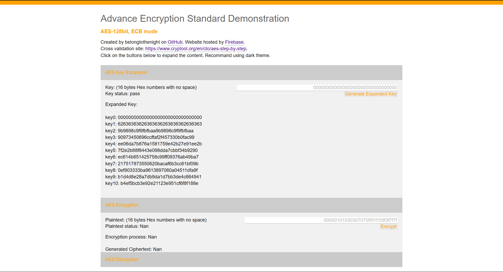

# NTC Code Report

Holds code for CYCUEE Number Theory and Cryptography. Go to [source](https://github.com/belongtothenight/NTC_Code) to see more.

## Result Reports

### Final Project

???+ Final

    With no requirement of thirdparty libraries, created a Advance Encryption Standard (AES) demonstration website hosted with firebase. Including Key Expansion, AES Encryption, AES Decryption. The site also display the intermediate calculation result.  
    Website: <https://ntc-demo-296be.web.app/>  
    Head to source: <https://ntc-demo-296be.web.app/>  
    Head to report: <https://github.com/belongtothenight/NTC_Code>  
    
